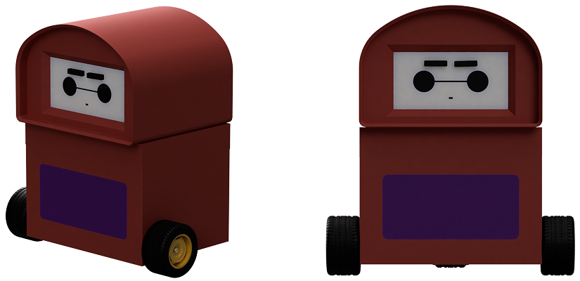

# Baymini

Baymini is an interactive robot developed for a Physical Computing University Module (2025). It responds to user interactions through a combination of sensing, mechanical movement and emotional states.

## Interactions

* **Piezo sensor:** Detects taps and tap rhythms to trigger happy or angry states.
* **ToF sensor:** Detects proximity near Baymini's mouth, triggering confused or sad states depending on interaction duration.
* **Inactivity:** Baymini returns to neutral and eventually falls asleep when left alone.
* **Level system:** Repeated interactions increase the intensity of happy, sad and angry states.
* **Movement:** Higher-level emotions trigger Baymini's wheels to move towards or away from the user.

## Hardware

* Arduino Uno
* VL53L0X ToF sensor
* Piezo disk
* Servo motor
* DC motors
* 3D-printed mechanical components

## Libraries

* Wire
* Servo
* VL53L0X

## Code

The Arduino sketch controls Baymini's sensor inputs, emotional state logic, breathing movement, eyebrow expressions and wheel movement.

[View the full Baymini project →](https://ikemenebeli.com/projects/baymini)
